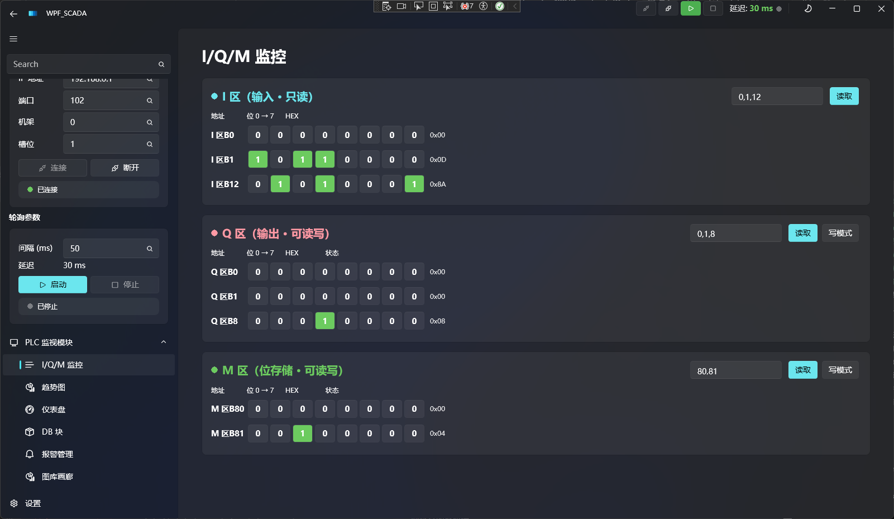
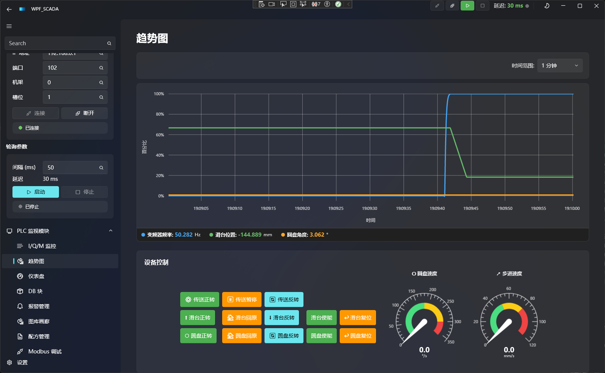
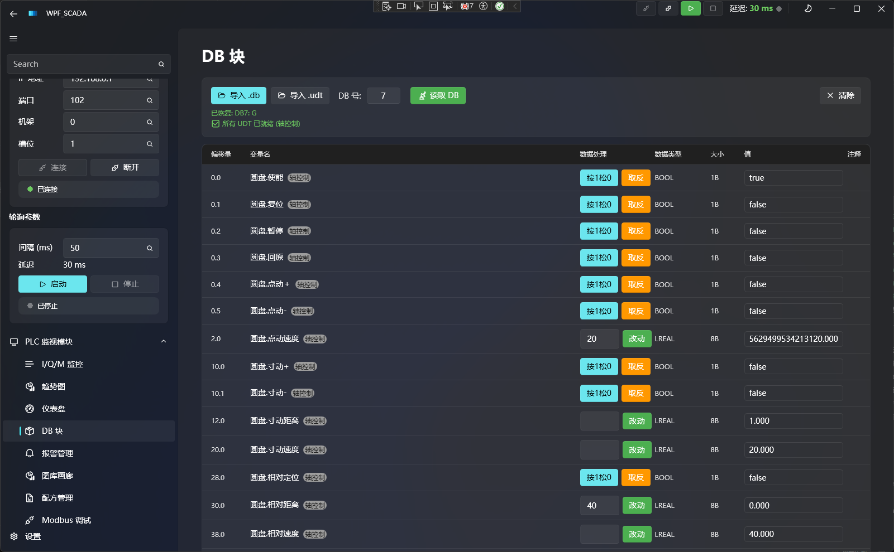
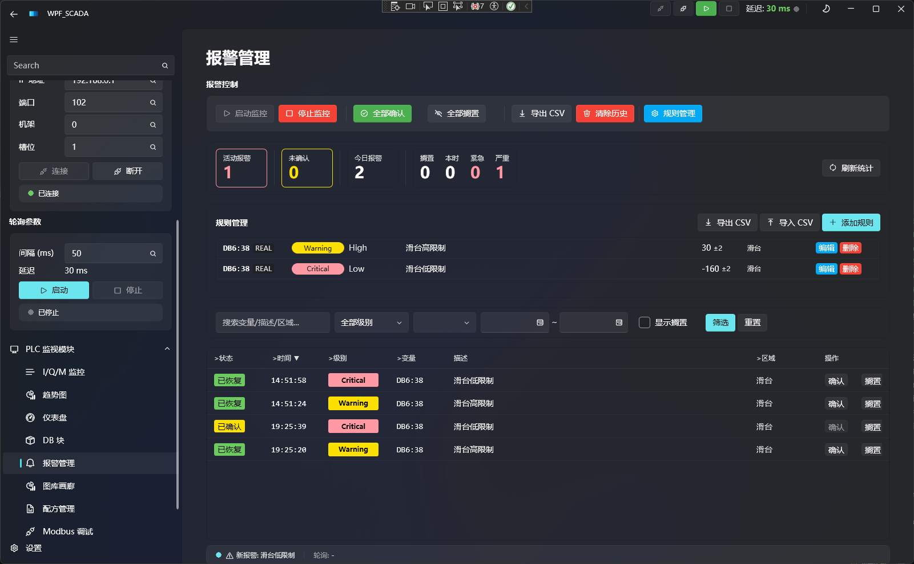
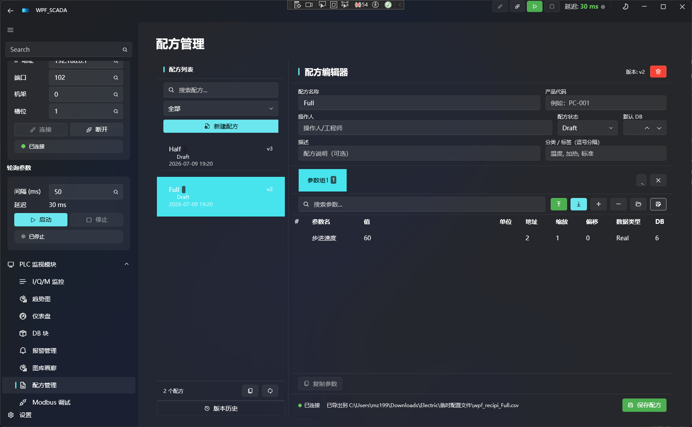
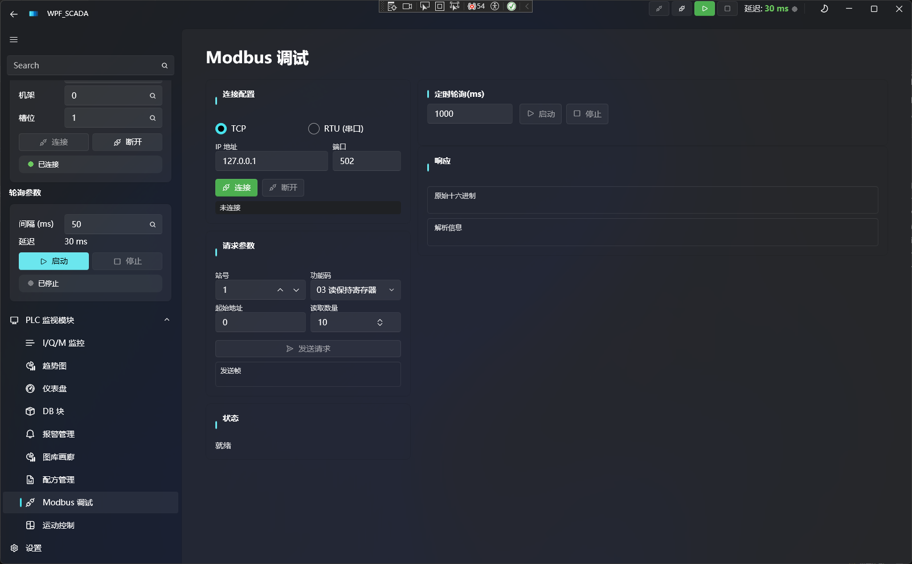

# WpfScada

WpfScada 是一个基于 WPF + Wpf.Ui 的 Windows 桌面上位机测试项目，用于连接西门子 S7 PLC 或本仓库的 `vPLC`，验证 PLC 通信、I/O 监控、DB 变量、趋势图、报警、配方和 Modbus 调试等工控界面能力。

项目来源于 WPF-UI Gallery 的裁剪和改造：保留了 Wpf.Ui 的导航、主题和控件示例能力，同时新增了 PLC 业务页面和服务层。

## 界面截图

### I/Q/M 监控



桌面端主监控页，左侧配置 S7 连接和轮询参数，右侧按位显示 I、Q、M 区状态。

### 趋势与设备控制



趋势图显示需要观测的指标的时间变化图, 下面的控制按钮可以自己设定控制按钮的操作内容。

### DB 块监控



DB 块页面可导入 `.db`/`.udt`文件，更改相应的 DB 号之后，可以对所有 DB变量查看并执行写入。

### 报警管理



报警控制台展示活动报警、未确认数量、规则阈值、历史记录和 CSV 导入导出操作。

### 配方管理



配方管理页维护配方列表、参数组、版本、默认 DB 和 CSV 导入导出。

### Modbus 调试



Modbus 调试页支持 TCP/RTU 配置、功能码、站号、地址、轮询周期和原始响应查看。

## 功能概览

- S7 PLC 连接、断开、轮询和延迟/质量状态显示。
- I/Q/M 区监控和变量轮询。
- DB 块变量监控，支持 TIA Portal DB/UDT 文件解析。
- 趋势图、仪表盘和 LiveCharts 展示页面。
- 报警管理和报警数据持久化。
- 配方管理，支持版本快照和历史记录。
- Modbus RTU/TCP 调试页面和协议栈。
- 运动控制测试页，当前使用 `MockMotionController`。
- 支持连接本仓库的 `vPLC` HTTP/S7 服务进行本地联调。
- 保留 Wpf.Ui Gallery 控件页面，方便继续扩展桌面 UI。

## 技术栈


| 层级     | 技术                                       |
| ------ | ---------------------------------------- |
| 桌面框架   | WPF + .NET 10                            |
| UI 框架  | Wpf.Ui 4.3.0                             |
| 架构     | MVVM + Microsoft.Extensions.Hosting + DI |
| PLC 通信 | Sharp7、自研 Modbus RTU/TCP                 |
| 图表     | LiveChartsCore.SkiaSharpView.WPF         |
| 本地编辑器  | WebView2 + Monaco 资源                     |
| 测试     | xUnit                                    |


## 快速开始

### 环境要求

- Windows
- .NET 10 SDK
- Visual Studio、Rider 或其他支持 .NET 10/WPF 的 IDE

### 启动

```bash
cd Project/WpfScada
dotnet restore
dotnet run --project WpfScada.csproj
```

也可以打开解决方案：

```txt
Project/WpfScada/WpfScada.sln
```

然后在 Visual Studio 中启动 `WpfScada` 项目。

## 连接 vPLC

如果要用本仓库的软 PLC 联调：

```bash
cd research/vplc
pnpm launch
```

然后在 WpfScada 中使用：


| 参数         | 值                                            |
| ---------- | -------------------------------------------- |
| IP         | `127.0.0.1`                                  |
| S7 端口      | `1200`，如发生端口回退请查看 `research/vplc/.port.json` |
| Rack       | `0`                                          |
| Slot       | `1`                                          |
| Modbus TCP | `127.0.0.1:1210`，如发生端口回退请查看 `.port.json`     |


## 数据持久化

运行时数据存储在 Roaming AppData：

```txt
%APPDATA%\WpfScada\
```

常见文件：


| 文件/目录                | 用途                  |
| -------------------- | ------------------- |
| `recipes/`           | 配方数据                |
| `recipes/_versions/` | 配方版本历史快照            |
| `kesa_config.json`   | 应用配置，包括 IP、端口、窗口位置等 |
| `alarms.json`        | 报警持久化记录             |
| `rules.json`         | 轮询规则                |
| `default-rules.json` | 默认轮询规则              |


这些数据不依赖 `bin/` 目录，执行 `dotnet clean` 或重新构建不会清空运行时数据。

## 项目结构

```txt
WpfScada/
├── App.xaml / App.xaml.cs          应用入口、Host/DI 注册、全局资源
├── Views/
│   ├── Windows/                    主窗口、Monaco 编辑器、沙箱窗口
│   ├── Pages/Plc/                  PLC 业务页：I/O、趋势、仪表盘、DB、报警、配方、Modbus、运动控制
│   └── Pages/*                     Wpf.Ui Gallery 示例页和基础控件页
├── ViewModels/
│   ├── Windows/                    窗口 ViewModel
│   ├── Pages/Plc/                  PLC 页面 ViewModel
│   └── Plc/                        连接区等复用 ViewModel
├── Services/
│   ├── Plc/                        S7、vPLC HTTP、轮询、报警、配方、DB/UDT 解析
│   ├── Plc/Modbus/                 Modbus 协议、传输和轮询
│   └── Motion/                     运动控制接口和 Mock 实现
├── Models/
│   ├── Plc/                        PLC 变量、报警、配方、趋势、轮询配置等模型
│   └── Monaco/                     Monaco 编辑器模型
├── Controls/
│   ├── Plc/                        PLC 相关自定义控件
│   ├── Input/                      输入控件
│   └── Sidebar/                    侧边栏控件
├── Helpers/                        Converter 和 UI 辅助类
├── Resources/                      多语言资源
├── Assets/
│   ├── Monaco/                     Monaco 编辑器静态资源
│   └── WinUiGallery/               Gallery 示例资源
├── Tests/WpfScada.Tests/           xUnit 测试项目
├── default-rules.json              默认轮询规则
├── WpfScada.csproj                 WPF 项目文件
└── WpfScada.sln                    解决方案
```

## 常用命令


| 命令                                     | 说明          |
| -------------------------------------- | ----------- |
| `dotnet restore`                       | 还原 NuGet 包  |
| `dotnet build WpfScada.sln`            | 构建应用和测试项目   |
| `dotnet run --project WpfScada.csproj` | 启动桌面应用      |
| `dotnet test WpfScada.sln`             | 运行 xUnit 测试 |


## 关键页面

PLC 业务页面集中在 `Views/Pages/Plc`：


| 页面                   | 用途             |
| -------------------- | -------------- |
| `IoMonitorPage`      | I/Q/M 区监控和轮询入口 |
| `TrendChartPage`     | 趋势曲线           |
| `GaugeDashboardPage` | 仪表盘            |
| `DbMonitorPage`      | DB 块变量监控       |
| `AlarmPage`          | 报警管理           |
| `RecipePage`         | 配方管理           |
| `ModbusPage`         | Modbus 调试      |
| `MotionPage`         | 运动控制测试         |


应用默认导航到 `IoMonitorPage`。

## 开发约定

- 新 PLC 页面优先放在 `Views/Pages/Plc`，对应 ViewModel 放在 `ViewModels/Pages/Plc`。
- PLC 通信、轮询、报警、配方等业务逻辑放在 `Services/Plc`，避免直接写进 XAML code-behind。
- 运行时配置通过 `AppConfigService` 管理，持久化到 `%APPDATA%\WpfScada\`。
- 需要新增导航项时，修改 `ViewModels/Windows/MainWindowViewModel.cs`。
- 更细的 C#、WPF 和 Wpf.Ui 约定见项目内 `.claude/rules/`。

## 当前边界

- 项目仍保留大量 Wpf.Ui Gallery 示例页，PLC 业务功能集中在 `PLC 监视模块` 导航节点下。
- 运动控制页目前使用 Mock 控制器，真实设备控制需要替换 `IMotionController` 实现。
- 这是上位机功能验证和桌面 UI 实验项目，现场生产使用前需要补齐权限、安全、日志审计和异常恢复策略。

