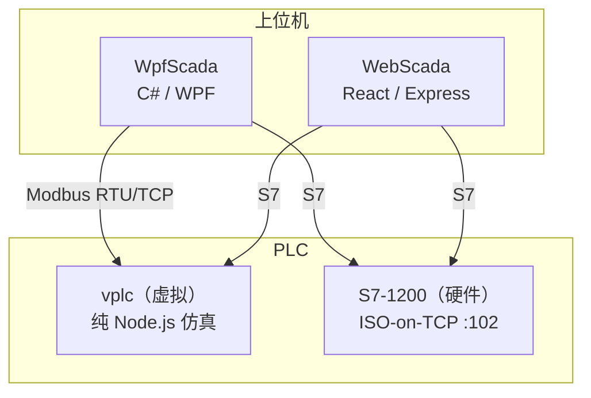

# VS_Dev

PLC 上位机开发与实验项目仓库。

## 项目一览

| 目录 | 说明 | 技术栈 |
|------|------|--------|
| [Project/WpfScada](./Project/WpfScada) | **C# 上位机 SCADA** — WPF + MVVM + Modbus/S7 协议 | .NET 10 + WPF-UI |
| [research/WebScada](./research/WebScada) | **Web 端 PLC 上位机** — 实时监控仪表盘 | React + Express + S7 |
| [research/vplc](./research/vplc) | **虚拟 S7-1200 软 PLC** — 纯软件 PLC 仿真 | Node.js + S7 + Modbus TCP |

## 架构关系

## 技术栈对比

| | WpfScada | WebScada | vplc |
|--|----------|----------|------|
| 语言/框架 | C# / .NET 10 | TypeScript / React | TypeScript / Node.js |
| 通信协议 | Modbus RTU/TCP, S7 | S7 (ISO-on-TCP) | S7 (ISO-on-TCP), Modbus TCP |
| 关键库 | Sharp7, WPF-UI, LiveCharts | nodes7, Express | 纯自研协议实现 |
| 启动方式 | `dotnet run` | `pnpm dev` | `pnpm launch` |
| 用途 | 生产级桌面 SCADA | Web 实时监控面板 | PLC 仿真测试 |

---
