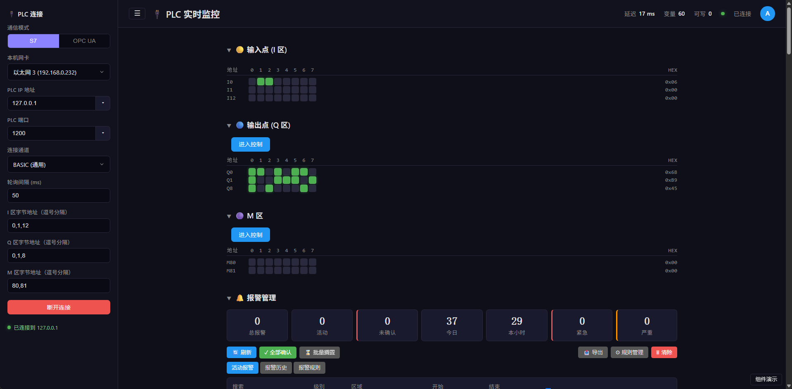
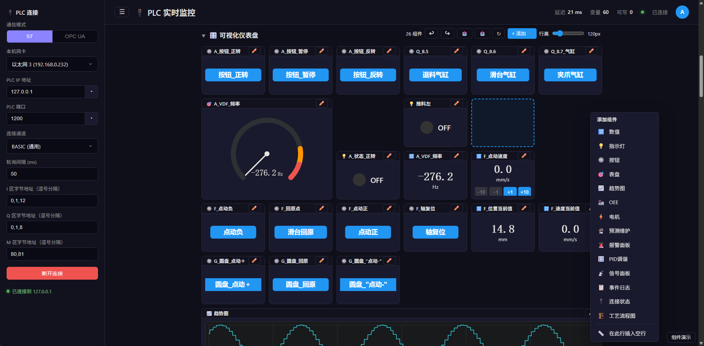
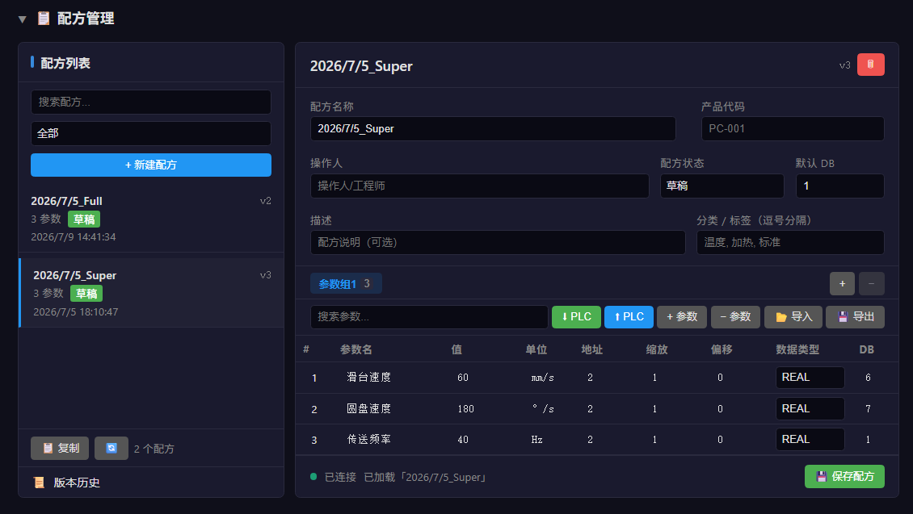
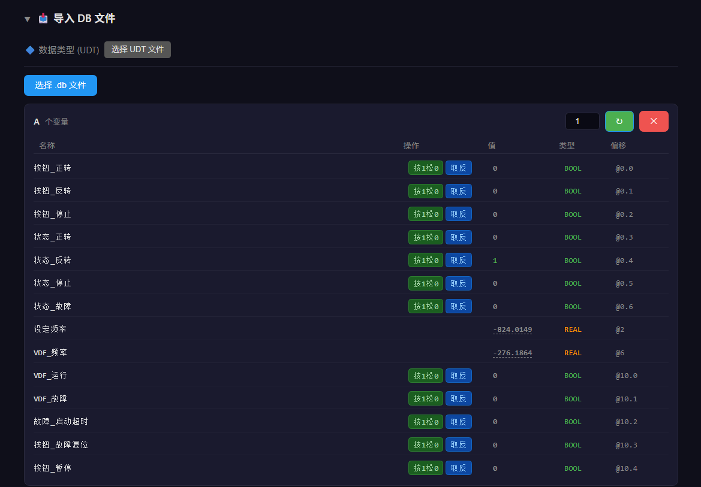
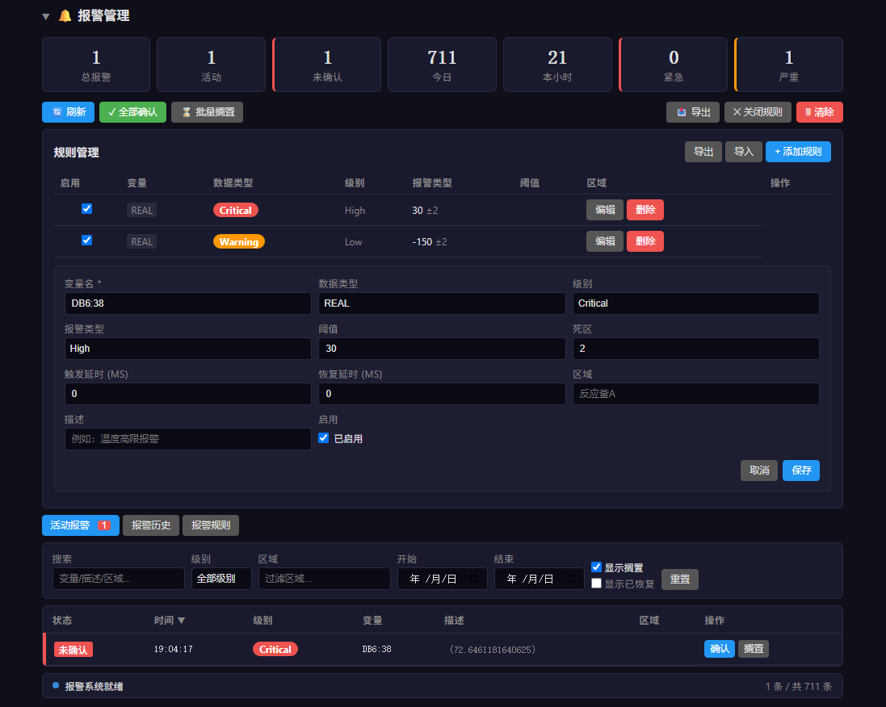

# WebScada PLC Monitor

WebScada 是一个基于 React + Express 的 Web 上位机实验项目，用于连接 S7 PLC 或本仓库的 `vPLC`，展示实时变量、I/Q 区状态、趋势、报警、事件和配方数据。

可以和 `vplc` 配合实现完全的本机模拟监控。

## 界面截图

### 实时监控



左侧配置 S7 连接参数，右侧实时显示 I/Q/M 点位、HEX 值和报警统计。

### 可视化仪表盘



可拖拽的运行看板，包含按钮、指示灯、表盘、数值卡、趋势图和组件添加菜单。

### 配方管理



配方列表和配方编辑器，可维护参数、默认 DB、版本和导入导出数据。

### DB 文件导入



导入 TIA Portal 的 UDT/DB 文件后，按字段展示变量名、类型、偏移和值，并支持写入。

### 报警管理



报警规则、活动报警和统计面板，可编辑阈值、确认报警、搁置报警并导入导出规则。

## 功能概览

- 连接 S7 PLC 或 vPLC，读取 DB 变量和 I/Q/M 区数据。
- 通过 SSE 向前端推送实时数据。
- 支持变量写入、I/Q 区写入、原始地址写入和导入 DB 后按字段写入。
- 支持 TIA Portal `.db` 和 `.udt` 文件导入，用于生成可视化 DB 变量。
- 提供趋势缓存和历史数据导出。
- 提供报警规则、活动报警、报警确认、屏蔽、历史和导入导出。
- 提供配方管理、版本快照、CSV/XLSX 导入导出和配方下发。
- 提供 OPC UA 连接、浏览、读写、订阅和变量映射接口。
- 内置简单用户认证、事件日志和诊断统计。

## 技术栈


| 层级     | 技术                                 |
| ------ | ---------------------------------- |
| 前端     | React 19 + Vite + TypeScript       |
| 后端     | Express + TypeScript + tsx         |
| PLC 通信 | nodes7                             |
| OPC UA | node-opcua                         |
| 数据存储   | JSON 文件 + better-sqlite3 历史数据      |
| 图表/界面  | React Grid Layout、Altara 组件、Sonner |
| 测试     | Vitest                             |


## 快速开始

### 环境要求

- Node.js 22+
- pnpm
- 如连接真实 S7-1200：PLC 需要启用 PUT/GET 访问，相关 DB 块需要关闭优化块访问

### 推荐启动方式

Windows 下可以直接运行：

```powershell
cd research/WebScada
.\start.ps1
```

`start.ps1` 会检查 Node.js、pnpm、`better-sqlite3` 原生模块和 API 端口，然后启动开发服务器。

### 手动启动

```bash
cd research/WebScada
pnpm install
pnpm dev
```

默认地址：


| 服务  | 地址                                        |
| --- | ----------------------------------------- |
| 前端  | `http://localhost:5173`                   |
| API | `http://localhost:3000` 或自动分配后的端口         |
| SSE | `http://localhost:<API端口>/api/plc/stream` |


后端会把实际 API 端口写入 `.port.json`，Vite 代理会读取它并把 `/api` 请求转发到正确端口。

## PLC 配置

默认 PLC 配置在 `server/config.ts`：

```ts
const config = {
  plc: {
    ip: '127.0.0.1',
    port: 1200,
    rack: 0,
    slot: 1,
  },
  pollInterval: 1000,
  ioRanges: {
    i: [{ start: 0, end: 1 }, { start: 8, end: 8 }],
    q: [{ start: 0, end: 1 }, { start: 8, end: 8 }],
  },
  variables: [
    { name: 'DB6:38', dbNumber: 6, offset: 38, type: 'real' },
  ],
}
```

连接真实 PLC 时，主要修改：

- `plc.ip`
- `plc.port`
- `rack` / `slot`
- `variables`
- `ioRanges`
- `pollInterval`

也可以通过前端连接面板在运行时切换连接参数。

## 项目结构

```txt
src/
  App.tsx                 前端主界面
  components/             看板、趋势、报警、配方、DB 导入等组件
  theme.ts                前端主题配置
server/
  index.ts                Express API 入口和轮询主流程
  plc.ts                  S7 连接、读写和变量解析
  opcua.ts                OPC UA 客户端能力
  alarmEngine.ts          报警规则、活动报警和历史报警
  recipeManager.ts        配方和版本管理
  historyStore.ts         历史数据落盘和导出
  eventLog.ts             事件日志
  diagnostics.ts          轮询诊断统计
  dbParser.ts             DB/UDT 文件解析
shared/
  types.ts                前后端共享类型
data/
  alarm-rules.json        报警规则
  alarm-history.json      报警历史
  recipes/                配方数据
  history/                历史数据
tests/                    Vitest 测试
```

## 常用命令


| 命令                 | 说明                       |
| ------------------ | ------------------------ |
| `pnpm dev`         | 同时启动 Express 后端和 Vite 前端 |
| `pnpm dev:server`  | 只启动后端                    |
| `pnpm dev:client`  | 只启动前端                    |
| `pnpm build`       | 构建前端                     |
| `pnpm start`       | 生产模式启动后端并托管构建产物          |
| `pnpm exec vitest` | 运行 Vitest 测试             |


## API 概览

主要接口分组：


| 分组     | 代表接口                                                                             | 说明                      |
| ------ | -------------------------------------------------------------------------------- | ----------------------- |
| PLC 连接 | `POST /api/plc/connect`、`POST /api/plc/disconnect`、`GET /api/plc/status`         | 连接状态和运行时连接参数            |
| 实时数据   | `GET /api/plc/data`、`GET /api/plc/stream`                                        | 当前数据快照和 SSE 推流          |
| PLC 写入 | `POST /api/plc/write`、`POST /api/plc/write-io`、`POST /api/plc/write-raw`         | 变量、I/Q 区和原始地址写入         |
| DB/UDT | `POST /api/plc/import-db`、`POST /api/plc/import-udt`、`GET /api/plc/imported-dbs` | TIA 文件导入和已导入 DB 管理      |
| 趋势历史   | `GET /api/trend`、`GET /api/history`、`GET /api/history/export`                    | 趋势缓存、历史查询和导出            |
| 报警     | `/api/alarm/*`                                                                   | 报警规则、活动报警、确认、屏蔽、历史和导入导出 |
| 配方     | `/api/recipe/*`                                                                  | 配方 CRUD、版本、导入导出和下发      |
| OPC UA | `/api/opcua/*`                                                                   | OPC UA 连接、浏览、读写、订阅和映射   |
| 诊断事件   | `/api/diagnostics`、`/api/events`                                                 | 轮询诊断和操作事件               |


## 和其他项目的关系

- 和 `research/vplc` 配合时，先启动 vPLC，再启动 WebScada，默认配置即可读写本地软 PLC。
- 和 `Project/WpfScada` 的定位不同：WebScada 是浏览器实时看板，WpfScada 是 Windows 桌面上位机。

## 当前边界

- 这是实验型 Web SCADA，不应直接作为生产系统部署。
- 默认认证和权限模型较轻，生产场景需要补充完整安全策略。
- 部分高级组件和 OPC UA 能力处于集成验证阶段，真实现场使用前需要按设备和变量表做专项测试。

