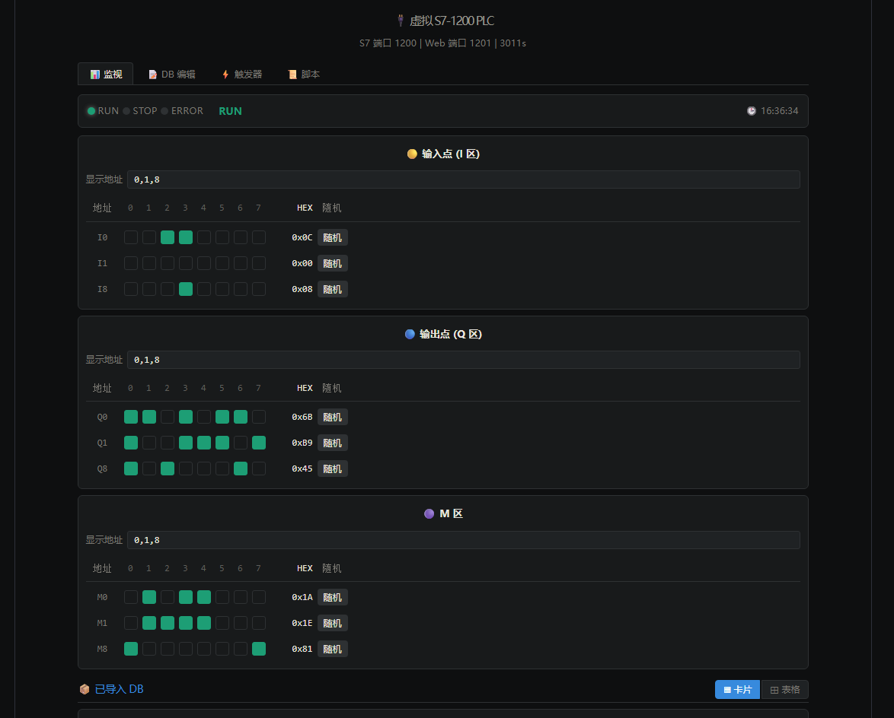
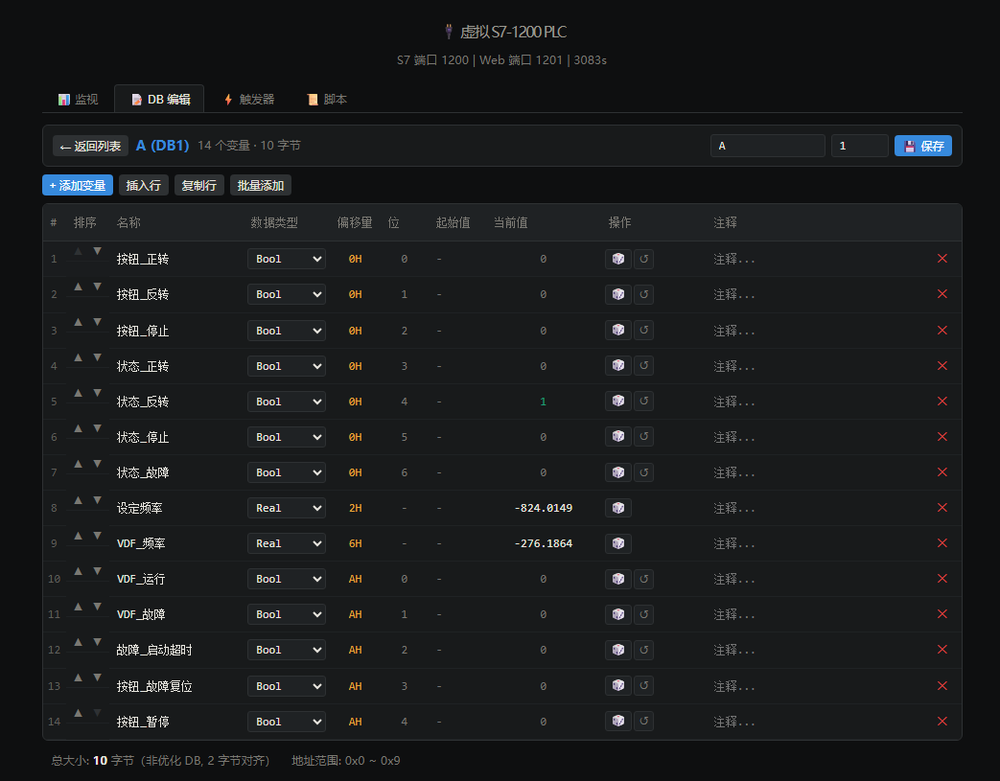
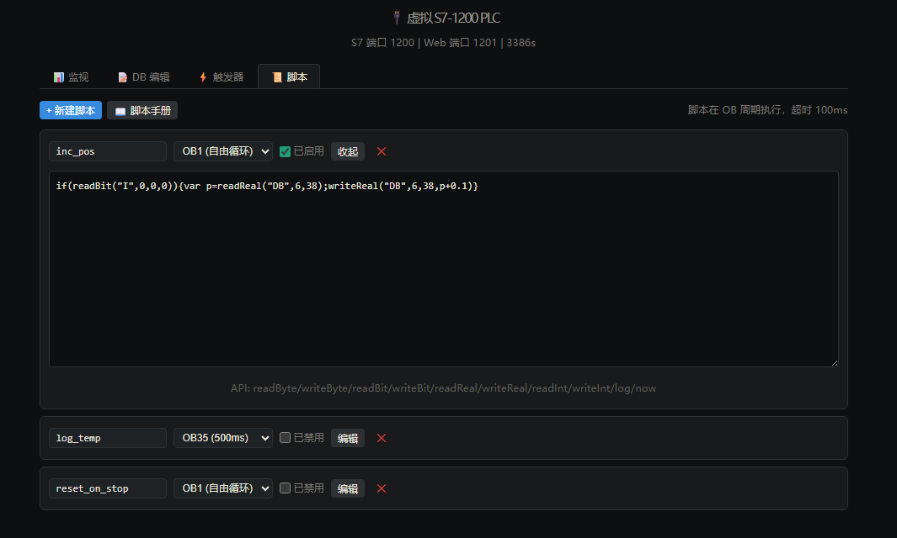

# vPLC

vPLC 是一个纯 Node.js 实现的虚拟 S7-1200 软 PLC，用于在没有真实 PLC、TIA Portal 或原生驱动依赖的情况下，给上位机和 Web SCADA 做协议联调、变量读写和界面验证。

它在本地同时提供 S7、Modbus TCP 和 HTTP API，默认可被本仓库里的 `WebScada` 和 `WpfScada` 连接。

## 界面截图

### 运行监控



RUN 状态下的 I/Q/M 位区监控与强制写入界面。这里不仅能查看字节地址、位状态和 HEX 值，也能直接修改 I/Q/M 指定字节里的任意位，用来模拟现场输入、输出和内部位存储状态。

### DB 变量编辑



DB1 变量表编辑界面，展示 Bool/Real 字段、偏移量、当前值和随机写入操作。

### 脚本配置



用户脚本管理界面，可按脚本手册里的规则编写类似 ST 的控制逻辑。脚本语言是 JavaScript，可绑定到 OB1、OB35 等周期，并通过 `readBit`、`writeBit`、`readReal`、`writeReal` 等 API 读写 PLC 内存。

## 功能概览

- 模拟 S7-1200 的常用通信行为，支持 S7 ISO-on-TCP 读写。
- 提供 Modbus TCP 服务，便于和传统 SCADA/HMI 工具联调。
- 内置 I/Q/M/DB/TM/CT 等内存区，支持 DB 块配置和持久化。
- 提供 Web 管理界面，可直接查看和修改 I/Q/M 任意字节位，导入 DB/UDT，编辑变量并执行写入。
- 支持用户脚本，用 JavaScript 编写类似 ST 的控制逻辑，并挂载到 OB1、OB35、OB100 等运行周期。
- 启动时自动恢复配置和内存数据，并把实际端口写入 `.port.json`。

## 技术栈

| 层级 | 技术 |
|---|---|
| 运行时 | Node.js + TypeScript + tsx |
| 协议服务 | 自研 S7 ISO-on-TCP、Modbus TCP |
| 管理界面 | React + Vite |
| 持久化 | JSON 文件 |

## 快速开始

### 环境要求

- Node.js 20+，建议使用 Node.js 22+
- pnpm

### 安装

```bash
cd research/vplc
pnpm install
```

### 启动

```bash
pnpm launch
```

启动后默认服务：

| 服务 | 默认地址 | 用途 |
|---|---|---|
| S7 | `127.0.0.1:1200` | 上位机通过 Rack `0`、Slot `1` 连接 |
| Web API | `http://localhost:1201/api/vplc` | 管理界面和外部工具访问 |
| Modbus TCP | `127.0.0.1:1210` | Modbus 客户端访问 |
| 前端管理界面 | `http://localhost:1420` | 浏览器操作 vPLC |

端口冲突时服务会尝试回退到可用端口，实际端口会写入 `.port.json`。

## 配置说明

主要配置文件是 `vplc-config.json`：

```json
{
  "port": 1200,
  "host": "0.0.0.0",
  "dbs": {
    "1": 12,
    "6": 46,
    "7": 46
  }
}
```

关键字段：

| 字段 | 说明 |
|---|---|
| `port` | S7 服务基准端口，Web API 默认使用 `port + 1`，Modbus 默认使用 `port + 10` |
| `host` | 监听地址，默认 `0.0.0.0` |
| `dbs` | DB 块号和字节长度 |
| `imported` | 从 TIA Portal `.db` 文件导入的变量定义 |
| `scripts` | 用户脚本和 OB 绑定关系 |
| `dbEditors` | Web 界面的 DB 编辑器定义 |

运行时内存保存在 `vplc-memory.json`。进程 PID 保存在 `vplc.pid`，用于启动时清理旧实例。

## 项目结构

```txt
server/
  vplc.ts           启动入口，创建 S7、HTTP、Modbus 服务
  s7-server.ts      TCP/COTP 连接管理
  s7-protocol.ts    S7 PDU 解析和响应组装
  modbus-server.ts  Modbus TCP 服务
  web-api.ts        HTTP API
  plc-memory.ts     I/Q/M/DB/TM/CT 内存区
  plc-runtime.ts    OB 周期、模拟数据、用户脚本
  persistence.ts    配置、内存和 PID 持久化
  dbParser.ts       TIA Portal DB/UDT 文件解析
frontend/           React + Vite 管理界面
vplc-config.json    PLC 配置、导入定义和脚本配置
vplc-memory.json    运行时内存快照
```

## 常用命令

| 命令 | 说明 |
|---|---|
| `pnpm launch` | 同时启动后端服务和前端管理界面 |
| `pnpm dev` | 只启动 vPLC 后端服务 |
| `pnpm dev:ui` | 只启动前端管理界面 |
| `pnpm client` | 运行示例客户端 |
| `cd frontend && pnpm build` | 构建前端管理界面 |

## API 概览

常用 HTTP API：

| 接口 | 说明 |
|---|---|
| `GET /api/vplc` | 获取内存区、DB 和状态快照 |
| `POST /api/vplc/write` | 写入字节、位、REAL 等值 |
| `POST /api/vplc/toggle-bit` | 切换位值 |
| `GET/POST /api/vplc/dbs` | 查看或调整 DB 块 |
| `POST /api/vplc/import-db` | 导入 TIA Portal `.db` 文件 |
| `POST /api/vplc/import-udt` | 导入 TIA Portal `.udt` 文件 |
| `GET/POST /api/vplc/scripts` | 管理用户脚本 |
| `GET /api/vplc/ob` | 查看 OB 执行统计 |
| `POST /api/vplc/state` | 切换 RUN/STOP |
| `GET /api/vplc/diag` | 查看诊断缓冲区 |
| `GET /api/vplc/modbus` | 查看 Modbus 服务状态 |

## 和其他项目的关系

- `research/WebScada` 默认连接 `127.0.0.1:1200`，可直接把 vPLC 当作 PLC 数据源。
- `Project/WpfScada` 可通过 S7 或 Modbus 页面连接 vPLC，用于桌面端上位机调试。

## 当前边界

- 目标是本地仿真和联调，不是完整 PLC 运行时。
- S7 支持覆盖常用读写和诊断场景，Block 上传下载、OPC UA Server、MQTT Bridge 等能力尚未实现。
- 用户脚本运行在 Node.js `vm` 沙箱中，适合测试逻辑，不适合承载高风险生产逻辑。
